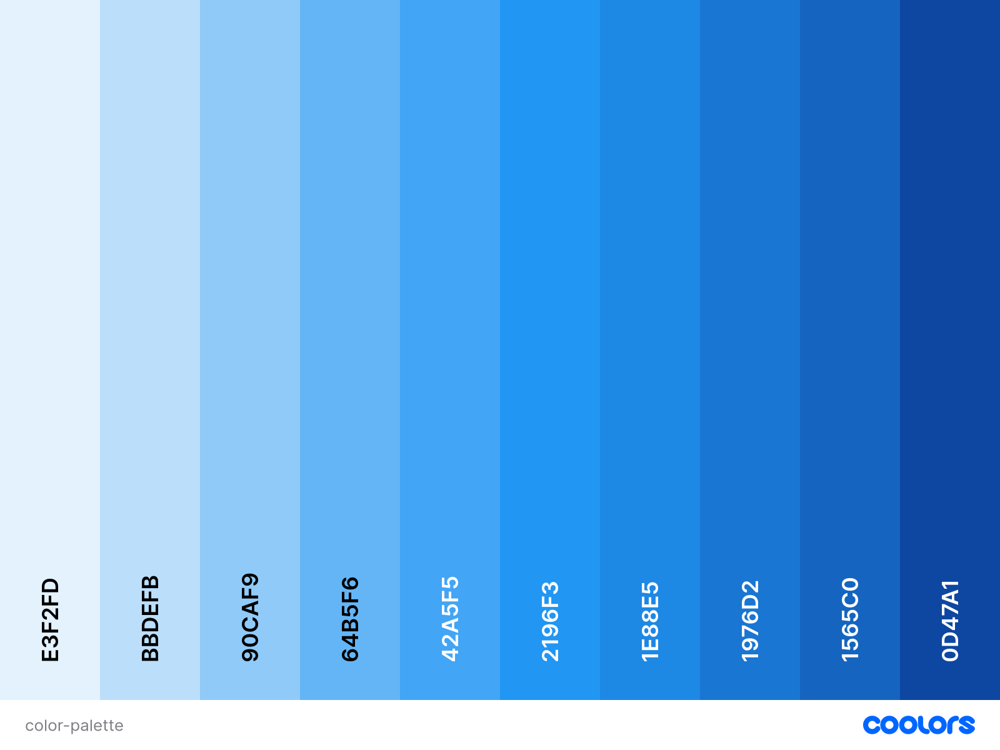

# WishListly - a chrome extension

WishListly is a lightweight and intuitive Chrome extension designed to help you capture and manage your ideas and links efficiently. Whether it's an interesting article, an item you want to purchase, or a brilliant idea, WishListly keeps everything organized in one place.

## Table of Contents
- [Features](#features)
- [Design and Style](#design-and-style)
- [Usage](#usage)
- [Credits](#credits)
- [License](#license)
- [Questions](#questions)

## Features
- **List a Wish**: Add your personal wishes and ideas directly into the extension.
- **Save Tab**: Save the current browser tab URL to your wish list for easy access later.
- **Delete All**: Clear your entire wish list with a single button.
- **Tagging**: Add tags to your wishes for better organization and filtering.

## Design and Style
- **Simple and Intuitive**: User-friendly interface that is easy to navigate.
- **Clean Design**: Modern and minimalist design to keep the focus on your wishes and ideas.
- **Responsive Layout**: Ensures a seamless experience across different screen sizes.

## Usage

## Credits
**Project Idea:** [Scrimba Frontend Developer Path](https://scrimba.com/learn/frontend).

**Color Scheme:** [Coolors](https://coolors.co/)

**Icon:** [Canva](https://www.canva.com/)

## License
MIT License

Copyright (c) [2024] [Adrianna Derkacz]

Permission is hereby granted, free of charge, to any person obtaining a copy of this software and associated documentation files (the "Software"), to deal in the Software without restriction, including without limitation the rights to use, copy, modify, merge, publish, distribute, sublicense, and/or sell copies of the Software, and to permit persons to whom the Software is furnished to do so, subject to the following conditions:

The above copyright notice and this permission notice shall be included in all copies or substantial portions of the Software.

THE SOFTWARE IS PROVIDED "AS IS", WITHOUT WARRANTY OF ANY KIND, EXPRESS OR IMPLIED, INCLUDING BUT NOT LIMITED TO THE WARRANTIES OF MERCHANTABILITY, FITNESS FOR A PARTICULAR PURPOSE AND NONINFRINGEMENT. IN NO EVENT SHALL THE AUTHORS OR COPYRIGHT HOLDERS BE LIABLE FOR ANY CLAIM, DAMAGES OR OTHER LIABILITY, WHETHER IN AN ACTION OF CONTRACT, TORT OR OTHERWISE, ARISING FROM, OUT OF OR IN CONNECTION WITH THE SOFTWARE OR THE USE OR OTHER DEALINGS IN THE SOFTWARE.

## Questions
For questions, please contact me at a.derkacz@gmail.com.
GitHub: [adriannaderkacz](https://github.com/adriannaderkacz).